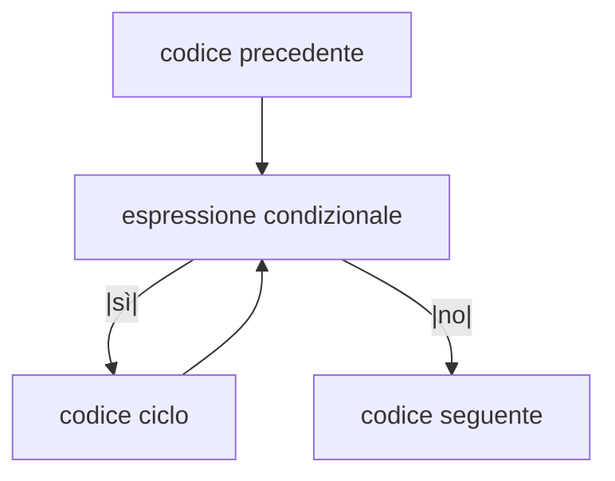
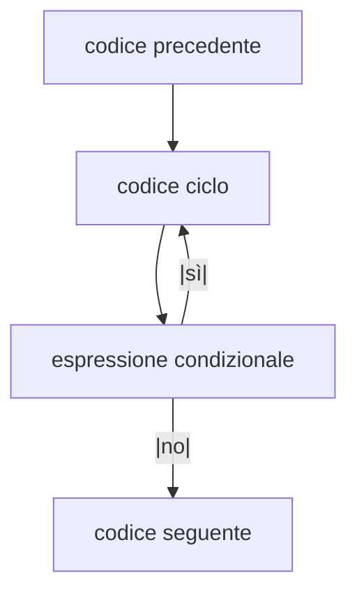

## Strutture di controllo

- `while`
- `for`
- `do {} while`

## Ciclo `for`

L'intestazione di un ciclo `for` può contenere espressioni arbitrarie.
Analogamente al ciclo `while`.

È convenzione usare:

- `expr 1`: inizializzazione della variabile del ciclo;
- `expr 2`: condizione di uscita del ciclo;
- `expr 3`: aggiornamento della variabile del ciclo;

## Ciclo `while {}` vs `do {} while`

- `while {}`:



- `do {} while`:



## `switch`

```c
switch (espressione) {
  case valore1: {
    // istruzioni
  }
  case valore2: {
    // istruzioni
    // Eseguito anche se `espressione` è uguale a `valore1`.
  }
  // ...
  default: {
    // istruzioni
    // Eseguito anche se `espressione` è uguale a `valore1` o `valore2`.
  }
}
```

Dopo avere valutato l'espressione, se il suo valore corrisponde a `valore1`, il
programma inizia ad eseguire da `valore1` in giù (tutti i casi sotto a `valore1`
vengono eseguiti). Per evitare questa cosa è necessario aggiungere l'istruzione
`break` alla fine del case in cui si vuole interrompere.

Il caso `default` non è obbligatorio ma viene eseguito se il valore di
`espressione` è diverso da tutti gli altri.

```c
switch (espressione) {
  case valore1: {
    // istruzioni
    break;
  }
  default: {
    // istruzioni
    // Non viene eseguito se `espressione` ha valore `valore1`.
  }
}
```

## `break` e `continue` nei cicli

Nei cicli `for`, `while {}`, `do {} while`:

- `break`: interrompe il ciclo e salta immediatamente all'istruzione dopo il
  ciclo.
- `continue`: interrompe questo giro del ciclo e inizia il giro successivo se
  l'espressione condizionale lo consente.

## Turing completeness

Si dice "Turing complete" qualsiasi linguaggio che ha:

- sequenze di istruzioni;
- selezioni;
- cicli;

Teorema di Boehm-Jacopini: tutte le strutture di controllo sono equivalenti a
quelle che si possono usare in assembly.
